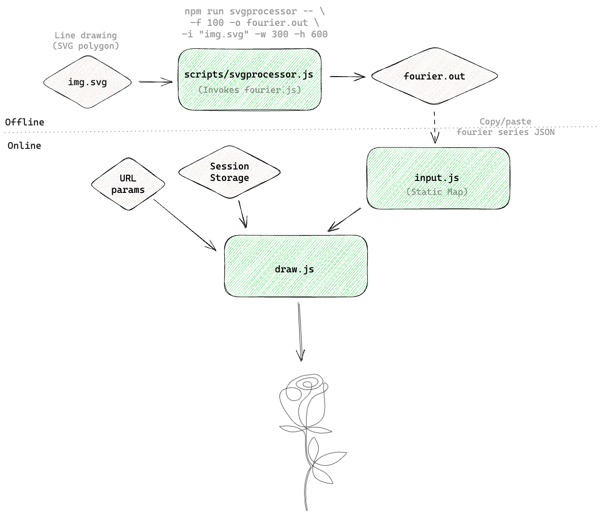

# draw43

Yet another 14 Feb project. This time it is 2D line drawing with Fourier series.

The input to the program is a svg file, which gets transformed to Fourier series and gets fed to a drawing program. It then simulates series as epicycles.

Drawing a rose isn't a bad idea. See it here: <TODO LINK> with debug param.

## Fourier

Complex Fourier series: any function can be expressed as sum of sine and cosine functions, and as th enumber of such functions approach ∞, the sum approaches original function. "Complex" because all this can be achieved with complex vectors rotating in complex plane each with some frequency.

Motivation: [What is fourier series? (YouTube)](https://www.youtube.com/watch?app=desktop&v=r6sGWTCMz2k)

## Relevant topics

Fourier transforms, Bazier curves, Affine transformation, P5js, Blender

## Design

