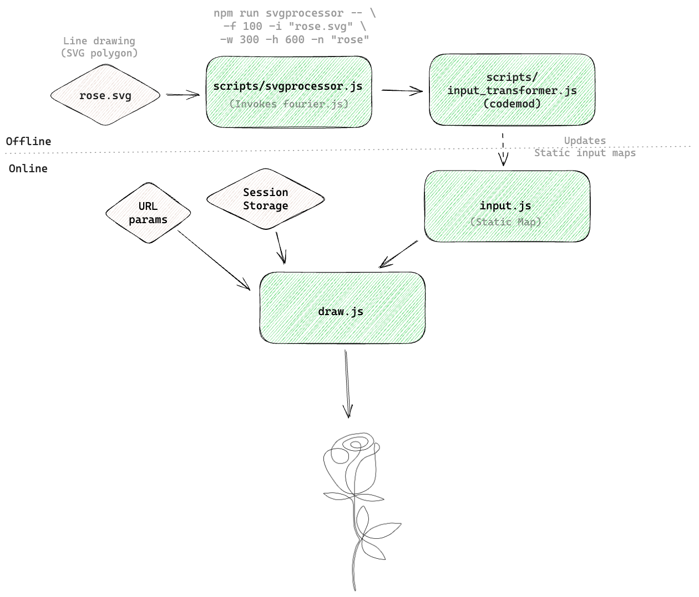

# draw43

Yet another 14 Feb project. This time it is 2D line drawing with Fourier series.

The input to the program is a SVG file. It gets transformed to Fourier series and gets fed to a drawing program. Which then simulates series as epicycles.

Drawing a rose isn't a bad idea: [see demo](https://jan25.github.io/draw43/?k=flow&speed=3).

Find complete workflow in design section below.

## Fourier

Complex Fourier series: any function can be expressed as sum of sine and cosine functions, and as the number of such functions approach ∞, the sum approaches original function. "Complex" because all this can be achieved with complex vectors rotating in complex plane each with some frequency.

Motivation: [What is fourier series? (YouTube)](https://www.youtube.com/watch?app=desktop&v=r6sGWTCMz2k)

## Relevant topics

Fourier transforms, Bazier curves, Affine transformation, P5js, Blender

## Design

